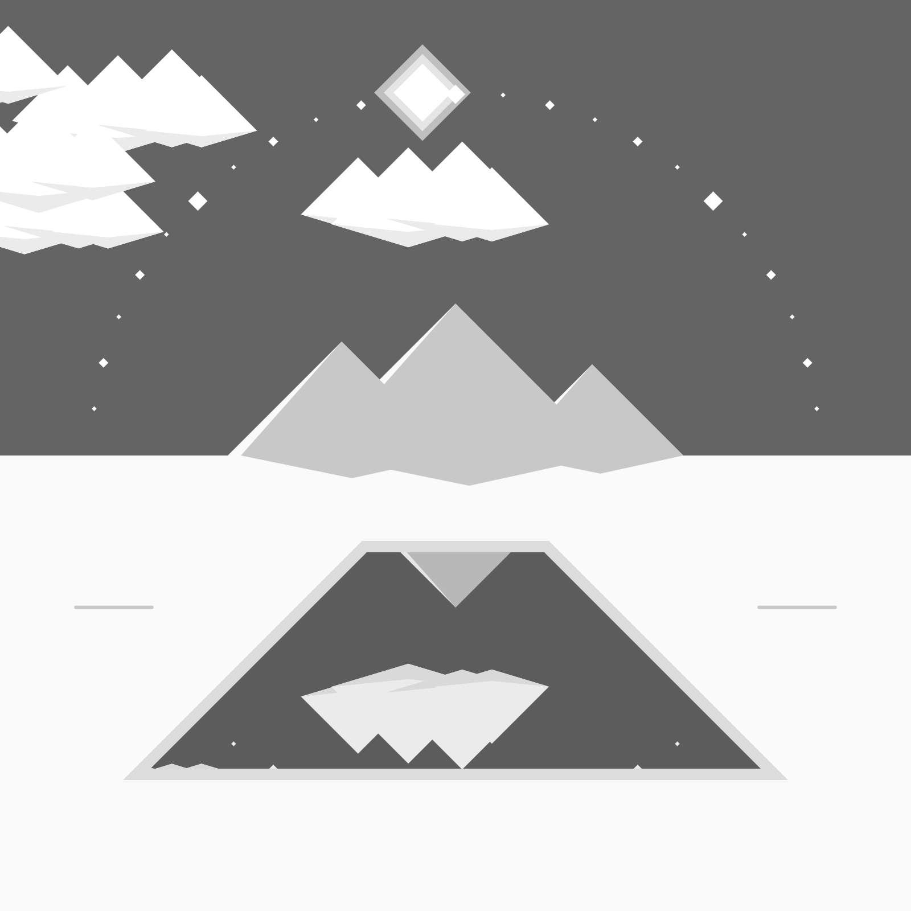
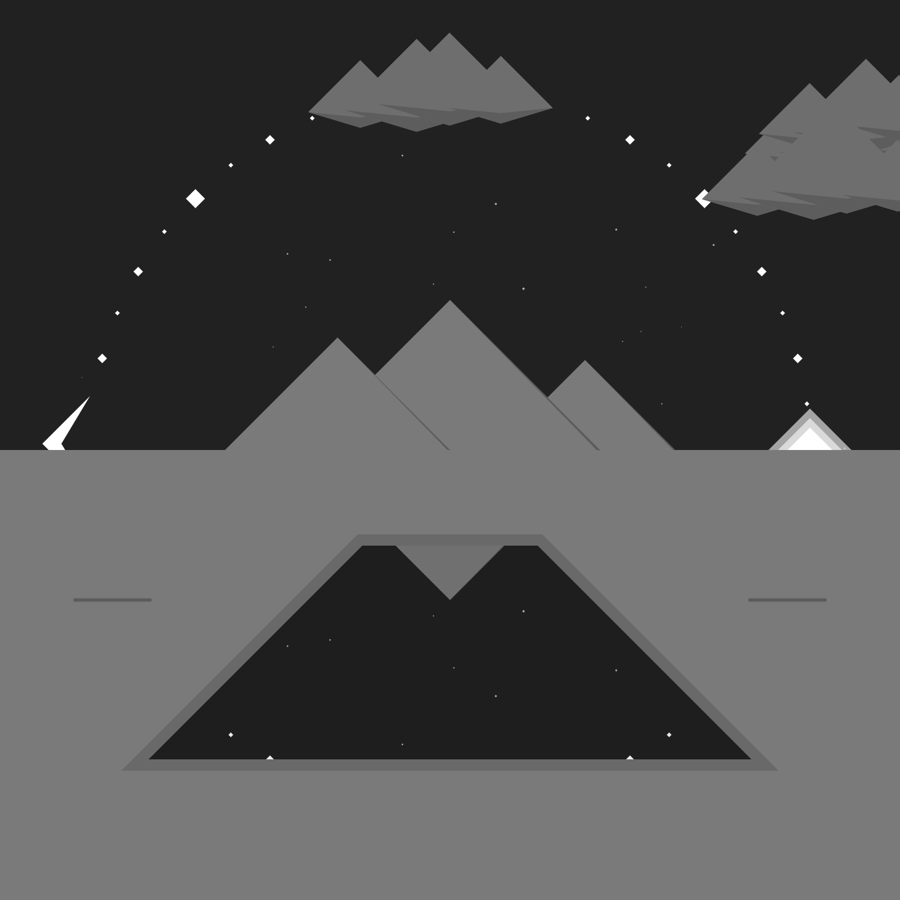
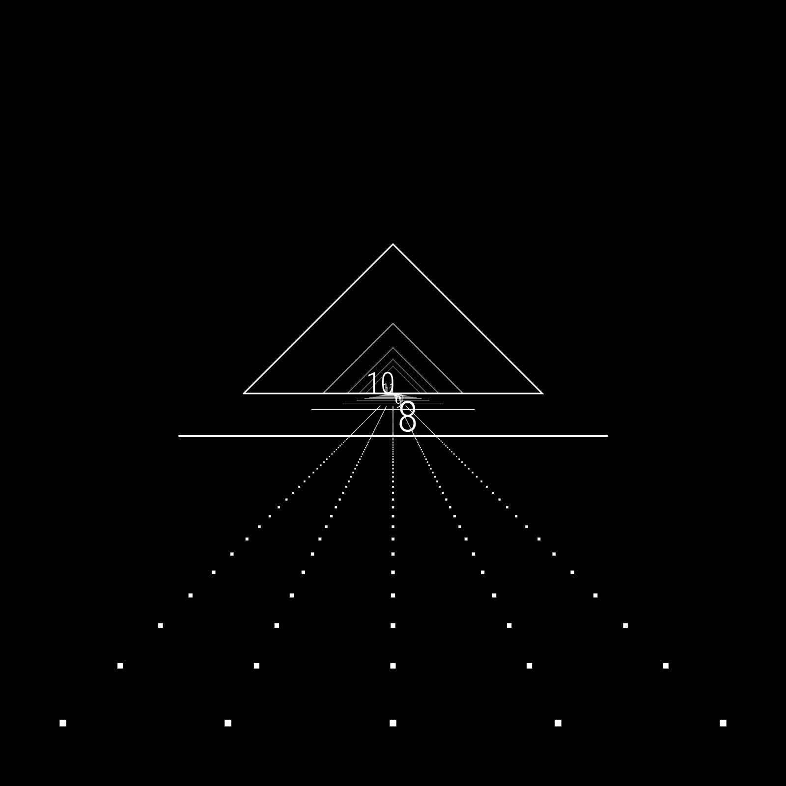
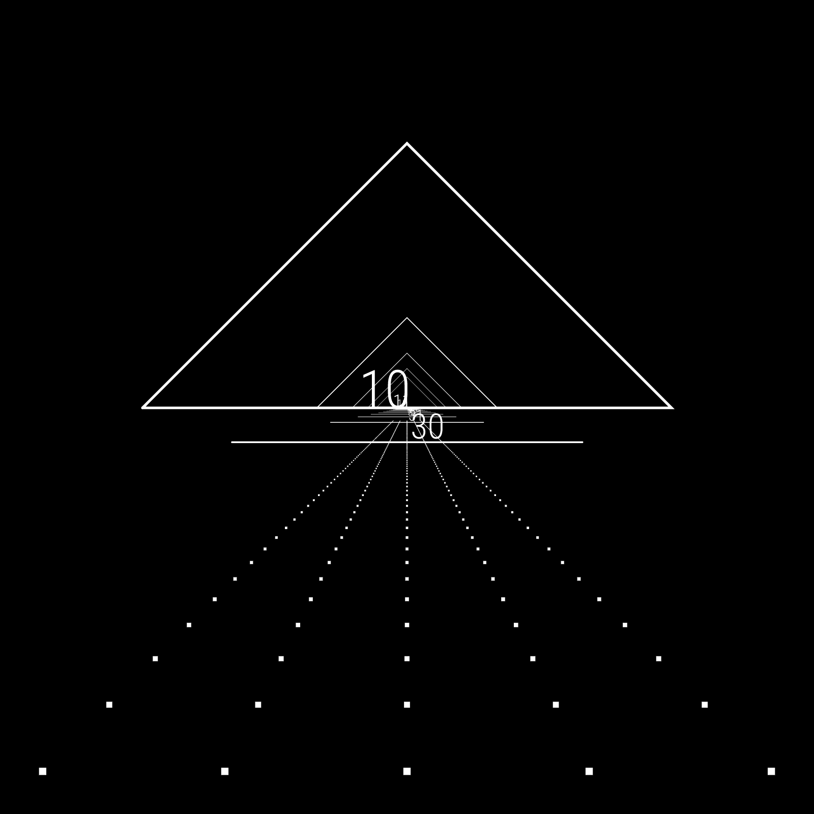
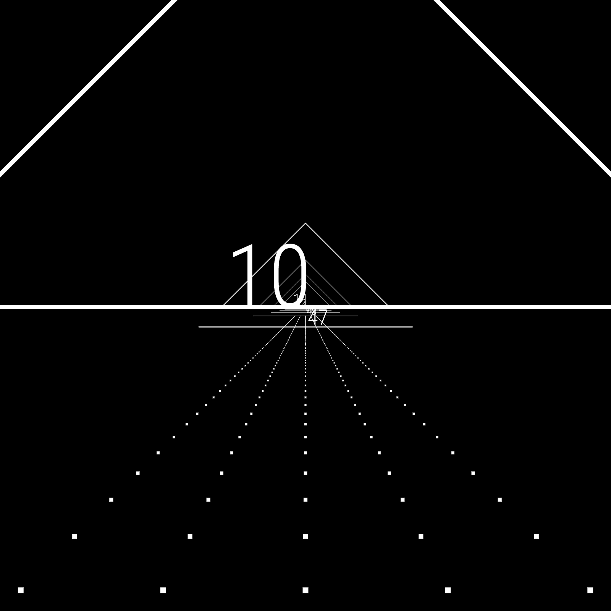
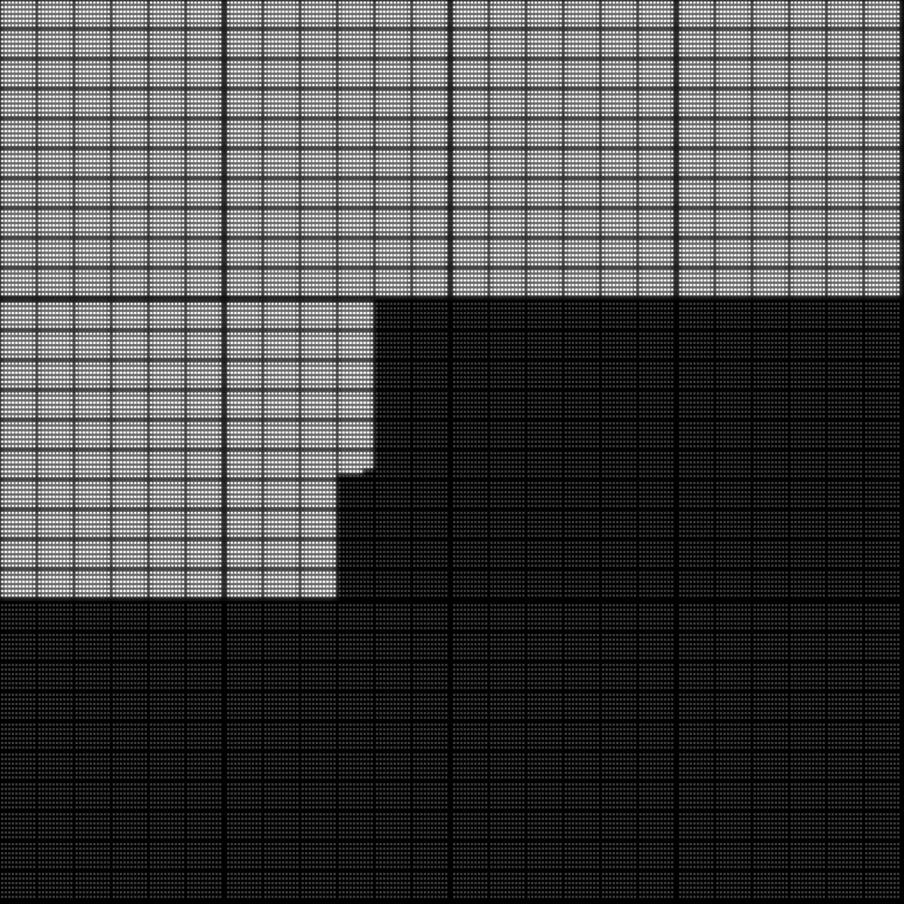
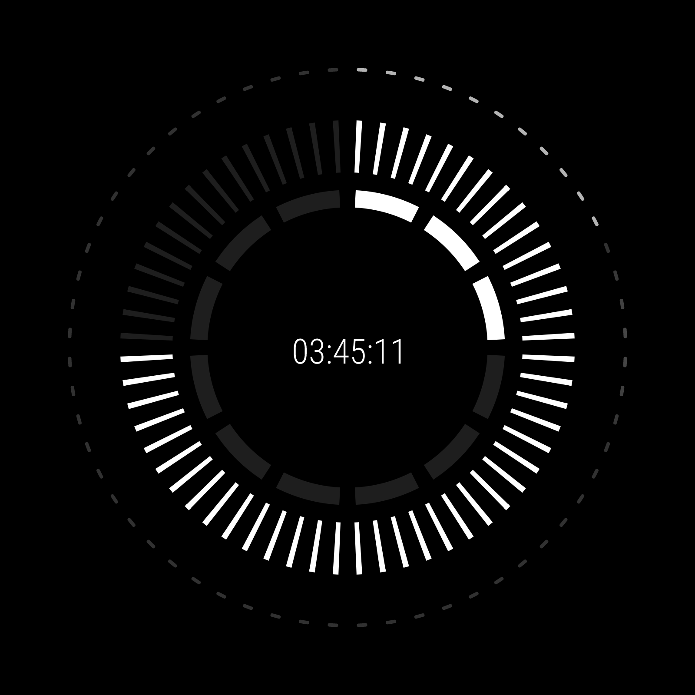
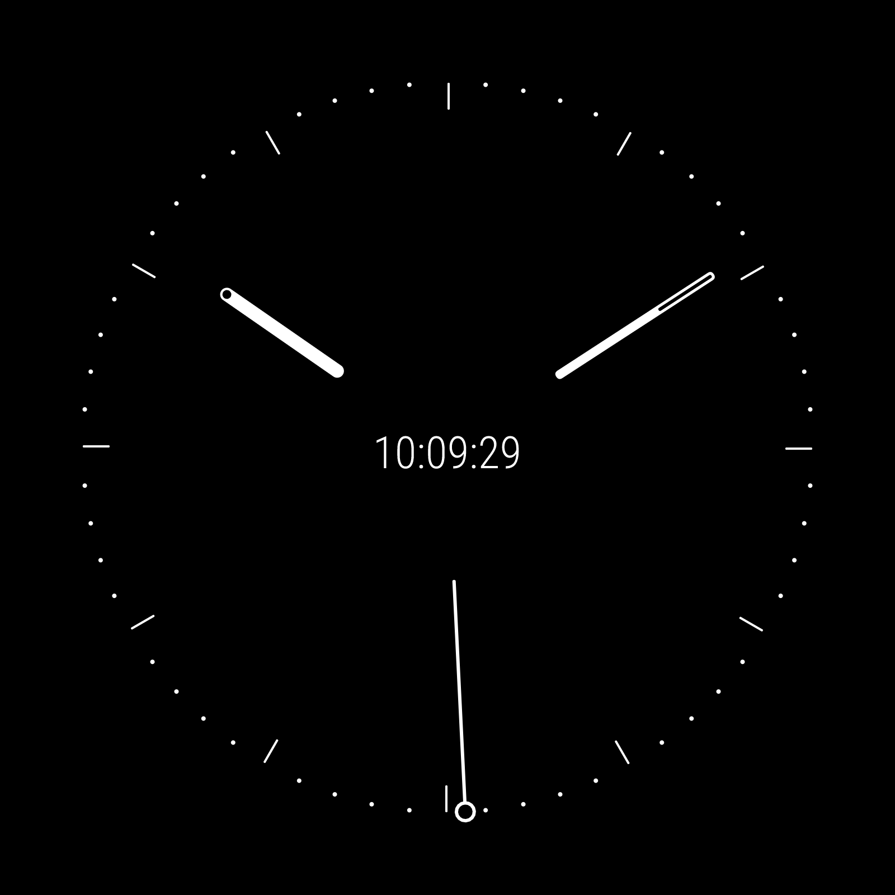

# Six Clocks

As an assignment for Information Design, we were tasked to design six clocks. No color allowed.

## 1. World

The current sun position is mirrored in this microcosm's day/night cycle.

[View in Browser](https://willy-vvu.github.io/SixClocks/World)

## 2. Journey

Time becomes distance as hours become mountains, passing slowly but surely.

[View in Browser](https://willy-vvu.github.io/SixClocks/Journey)

## 3. Scale

An exponentially warped space reveals time passage at multiple scales.

[View in Browser](https://willy-vvu.github.io/SixClocks/ScaleClock)

## 4. Grid

Each second is a dot, visualized across 12 hours.

[View in Browser](https://willy-vvu.github.io/SixClocks/Clock04)

## 5. Ring

Segments of concentric rings fill to tell the time.

[View in Browser](https://willy-vvu.github.io/SixClocks/Clock06)

## 6. Analog

A stylized remake of the analog clock.

[View in Browser](https://willy-vvu.github.io/SixClocks/Clock12)

---

Assignment for: 4.032 Information Design

Learning Focus: Information Design, p5.js

Media: Digital Sketch, Data Visualization

Software: p5.js

Date: February 2017
